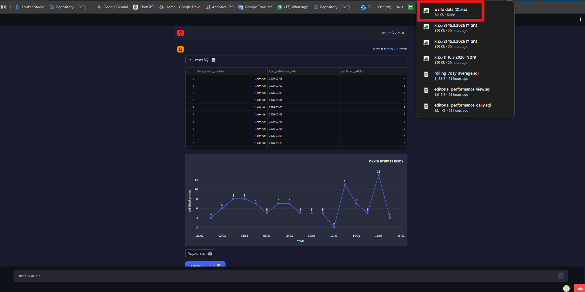

# 📊 Omer Diller — BI Developer Portfolio

> BigQuery SQL • Looker Studio • AI Dashboards • Google Analytics 4

---

## 🚀 Projects

### 1. 📰 Walla News — Editorial Performance Dashboard

A daily dashboard sent automatically every morning to writers, editors, and managers at Walla News.

Each person sees their own performance data — no need to ask anyone, no need to wait.

**Built with:** Google Analytics 4 → BigQuery (SQL pipeline) → Looker Studio

**What it shows:**
- Most viewed articles yesterday
- Daily and monthly view counts
- Average daily views per author
- Number of articles published

**How it works:**
- GA4 collects events from the website
- A scheduled SQL pipeline in BigQuery processes and cleans the data daily
- Looker Studio connects to BigQuery and displays the report
- Data blending is used to combine multiple sources in one view

**📂 SQL pipeline:** [`sql/v2-editorial-pipeline/`](./sql/v2-editorial-pipeline/)
**📸 Screenshots:** [`screenshots/looker-studio-dashboard/`](./screenshots/looker-studio-dashboard/)

---

### 2. 🤖 Walla News — AI Analytics Dashboard

A dynamic chat-based dashboard where any manager can ask a question in Hebrew and get an instant answer — no SQL needed.

Built as a web app using Python and deployed online, so it's accessible from any browser.

**🔴 Live demo:** [walla-dynamic-dashboard.streamlit.app](https://walla-dynamic-dashboard.streamlit.app)
**💻 Code:** [analytics-walla/dynamic-dashboard](https://github.com/analytics-walla/dynamic-dashboard)
**📖 Full project story:** [PROJECT_STORY.md](./dashboards/walla-ai-dashboard/PROJECT_STORY.md)



**How it works:**
- Manager types a question in Hebrew (e.g. "how many articles were published this week by author?")
- Gemini 2.5 Flash translates it to SQL
- BigQuery runs the query on the data warehouse
- Results appear as a table + automatic chart
- One click to download as Excel

**Built with:** Python · Streamlit · Google Gemini 2.5 Flash · BigQuery · Plotly · Streamlit Cloud

**📂 Code:** [`dashboards/walla-ai-dashboard/`](./dashboards/walla-ai-dashboard/)

---

## 🗂️ Repository Structure

```
bi-portfolio/
├── README.md
├── sql/
│   ├── v1-editorial-pipeline/
│   │   ├── editorial_performance_daily.sql
│   │   ├── editorial_performance_view.sql
│   │   └── rolling_7day_average.sql
│   └── v2-editorial-pipeline/
│       ├── editorial_performance_daily_v2.sql
│       ├── editorial_staff_mapping_view.sql
│       ├── editorial_video_daily.sql
│       ├── Mart_Content_Performance_CREATE.sql
│       └── Mart_Content_Performance_scheduled.sql
├── dashboards/
│   └── walla-ai-dashboard/
│       ├── app.py
│       ├── requirements.txt
│       └── PROJECT_STORY.md
└── screenshots/
    ├── looker-studio-dashboard/
    └── walla-ai-dashboard/
```

---

## 🛠️ Skills

| Skill | Where |
|-------|--------|
| BigQuery SQL (CTEs, UNNEST, HLL, Window Functions) | `sql/` |
| GA4 event data processing | `editorial_performance_daily_v2.sql` |
| HLL sketches for unique user counts | `v2-editorial-pipeline/` |
| Multi-platform pipeline (Web + App) | `editorial_performance_daily_v2.sql` |
| Looker Studio (data blending, calculated fields) | `screenshots/looker-studio-dashboard/` |
| Python (Streamlit, Pandas, Plotly) | `app.py` |
| Prompt Engineering (Hebrew → SQL) | `app.py` |
| Cloud deployment (Streamlit Cloud) | `PROJECT_STORY.md` |
| Google Cloud (BigQuery, Service Accounts, IAM) | `PROJECT_STORY.md` |

---

## 📬 Contact

**Omer Diller** — BI Developer | Walla News

---
---

# 📊 עומר דילר — תיק עבודות BI

> BigQuery SQL • Looker Studio • דשבורדים מבוססי AI • Google Analytics 4

---

## 🚀 פרויקטים

### 1. 📰 וואלה — דשבורד ביצועי מערכת

דשבורד יומי שנשלח אוטומטית כל בוקר לכתבים, עורכים ומנהלים בוואלה.

כל אחד רואה את נתוני הביצועים שלו — בלי לבקש מאף אחד, בלי לחכות.

**טכנולוגיות:** Google Analytics 4 → BigQuery (פייפליין SQL) → Looker Studio

**מה רואים:**
- הכתבות הכי נצפות אתמול
- כמות צפיות לפי יום וחודש
- ממוצע צפיות יומי לפי כתב
- כמות פרסומים

**איך זה עובד:**
- GA4 אוסף אירועים מהאתר
- פייפליין SQL ב-BigQuery מעבד ומנקה את הנתונים כל יום אוטומטית
- Looker Studio מתחבר ל-BigQuery ומציג את הדוח
- שימוש ב-Data Blending לחיבור מספר מקורות נתונים בתצוגה אחת

**📂 פייפליין SQL:** [`sql/v2-editorial-pipeline/`](./sql/v2-editorial-pipeline/)
**📸 צילומי מסך:** [`screenshots/looker-studio-dashboard/`](./screenshots/looker-studio-dashboard/)

---

### 2. 🤖 וואלה — דשבורד AI דינאמי

דשבורד צ'אט דינאמי שבו כל מנהל יכול לשאול שאלה בעברית ולקבל תשובה מיידית — בלי לדעת SQL.

נבנה כאפליקציית ווב בפייתון ופורס אונליין, כך שנגיש מכל דפדפן.

**🔴 דמו חי:** [walla-dynamic-dashboard.streamlit.app](https://walla-dynamic-dashboard.streamlit.app)
**💻 קוד:** [analytics-walla/dynamic-dashboard](https://github.com/analytics-walla/dynamic-dashboard)
**📖 סיפור הפרויקט המלא:** [PROJECT_STORY.md](./dashboards/walla-ai-dashboard/PROJECT_STORY.md)

**איך זה עובד:**
- המנהל כותב שאלה בעברית (למשל: "כמה כתבות פורסמו השבוע לפי כתב?")
- Gemini 2.5 Flash מתרגם לSQL
- BigQuery מריץ את השאילתה על מחסן הנתונים
- התוצאות מוצגות כטבלה + גרף אוטומטי
- לחיצה אחת להורדה לאקסל

**טכנולוגיות:** Python · Streamlit · Google Gemini 2.5 Flash · BigQuery · Plotly · Streamlit Cloud

**📂 קוד:** [`dashboards/walla-ai-dashboard/`](./dashboards/walla-ai-dashboard/)

---

## 🛠️ מיומנויות

| מיומנות | איפה |
|---------|------|
| BigQuery SQL (CTEs, UNNEST, HLL, Window Functions) | תיקיית `sql/` |
| עיבוד נתוני GA4 | `editorial_performance_daily_v2.sql` |
| HLL sketches לספירת גולשים ייחודיים | `v2-editorial-pipeline/` |
| פייפליין רב-פלטפורמי (Web + App) | `editorial_performance_daily_v2.sql` |
| Looker Studio (data blending, calculated fields) | `screenshots/looker-studio-dashboard/` |
| Python (Streamlit, Pandas, Plotly) | `app.py` |
| Prompt Engineering (עברית → SQL) | `app.py` |
| פריסה בענן (Streamlit Cloud) | `PROJECT_STORY.md` |
| Google Cloud (BigQuery, Service Accounts, IAM) | `PROJECT_STORY.md` |

---

## 📬 יצירת קשר

**עומר דילר** — מפתח BI | אנליטיקס וואלה
